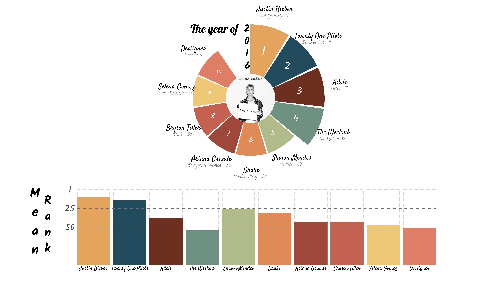
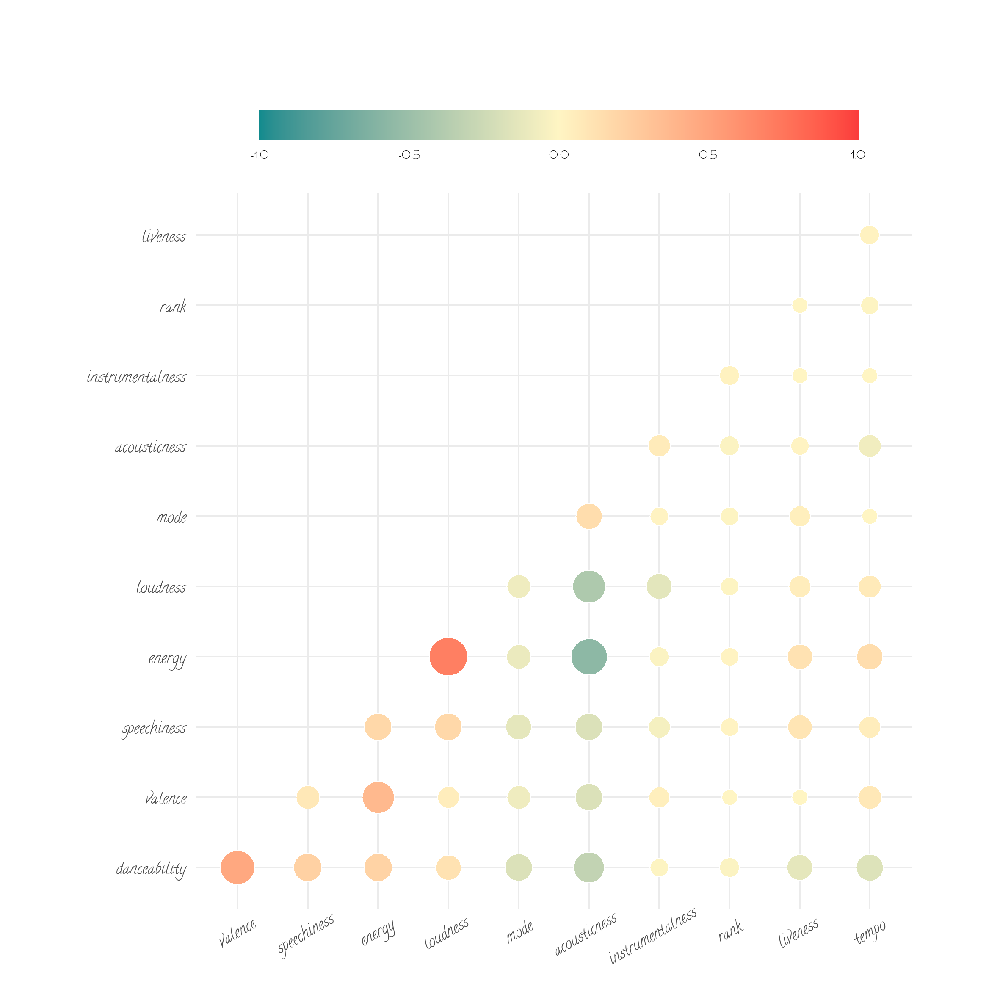
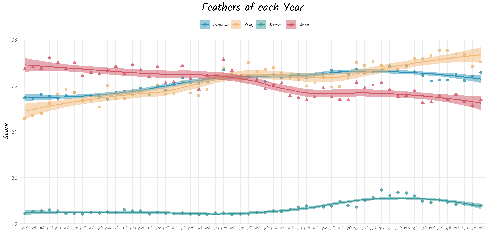
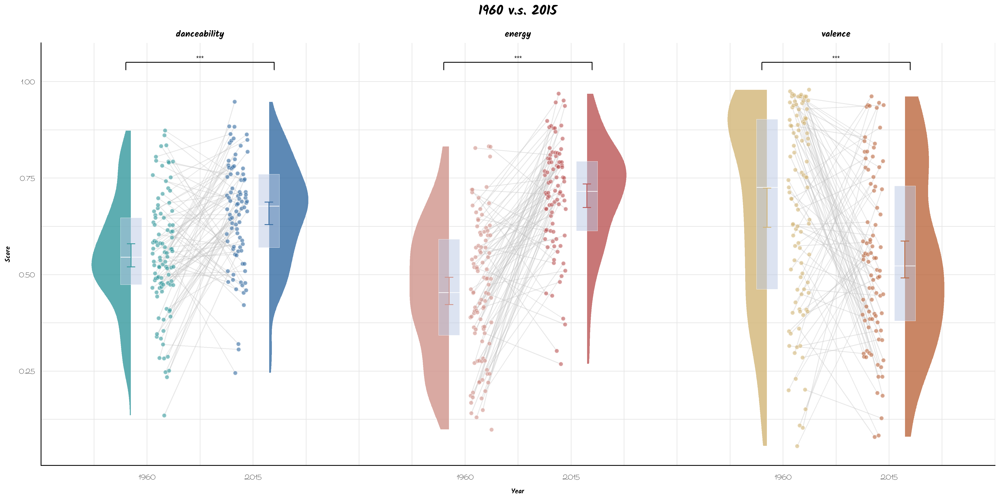

### **本文利用开放R包 *billboard* 中的数据：**

-   展示如何利用R以及ggplot2包进行数据分析并形成出版级别的可视化效果
-   展现2016年年度十大歌手及其代表作品
-   分析半个多世纪以来，年度Top100歌曲在某些特征上的时间变化
-   对比1960年与2015年的歌曲特征，揭示不同时代的受欢迎的音乐特点

文章包括分析代码、可视化结果以及相关的分析结论。

**话不多说，直接进入正题**

### **一、前期准备**

```{r message=FALSE}
#首先加载会使用到的包
library(tidyverse)
library(MetBrewer)
library(cowplot)
library(billboard)
library(extrafont)
library(cowplot)
library(showtext); showtext_auto()
library(ggcorrplot)
library(ggsci)
library(gghalves)
library(ggprism)
library(ggsignif)
library(car)
library(ggbump)
#从GoogleFonts导入字体
font_add_google("Satisfy", "satisfy")
font_add_google("Sacramento", "mento")
font_add_google("Lobster", "lobster")
font_add_google("Luckiest Guy", "luck")
font_add_google("Calligraffitti", "call")
font_add_google("Kalam", "kalam")
font_add_google("ZCOOL KuaiLe", "cool")
```

```{r 加载数据}
#读入数据
head(spotify_track_data)
head(wiki_hot_100s)
```

从表格中可以看到**wiki_hot_100s**数据反映了从1960年到2016年的年度TOP100单曲，包含四个变量：

1.  歌曲排行：no
2.  歌曲名称：title
3.  歌手名称：artist
4.  歌曲年份：year

**spotify_track_data**数据则反映了其中大部分歌曲在多个特征维度上的评价情况

:raised_hands:前期工作完成:raised_hands:

下面尝试对这些数据进行分析，看看能不能得到什么有趣的结果

### **二、正式分析**

#### **1.歌手排名**

经过大致的数据浏览，我决定选取2016年的数据，以**歌曲上榜数量**以及**歌曲平均排行**为指标，决出当年的十大歌手。

```{r message=FALSE, warning=FALSE}
#数据清洗
singer <- wiki_hot_100s %>%
  mutate(year = as.numeric(year),
         no = as.numeric(no)) %>%
  filter(year %in% 2016 & no <= 100) %>% #选出目标数据并过滤缺失数据
  group_by(artist) %>%
  mutate(best = min(no),
         num = n(),
         no_all = sum(no)) %>% #找到每个歌手的最佳作品和上榜歌曲总数
  ungroup %>%
  mutate(mean_no = no_all/num) %>%
  arrange(desc(num), mean_no) %>%
  group_by(artist) %>%
  mutate(rank = 1:n()) %>%
  filter(rank == 1) %>%
  select(-c(year,rank,no)) %>%
  ungroup() %>%
  mutate(rank = row_number())
#选择前10歌手
top_10 <- singer[1:10,] %>%
  mutate( angle = 360 - rank*(360 / (max(rank)+1)),
          angle = ifelse(angle < -90, angle +180, angle),
          mean_no = round(mean_no)) #计算平均歌曲排名
```

```{r message=FALSE, warning=FALSE}
#结果可视化
image = "https://raw.githubusercontent.com/wht9975/website/master/images/loveuself.png"
#子图1
top_10 %>%
  ggplot()+
  ggimage::geom_image(aes(x = 0, y = -1.5, image = image),size=0.19) +
  geom_col(aes(x=rank, y=num, fill = artist),show.legend = F, width = 0.95)+
  coord_polar(theta = 'x',direction = 1,start = -0.3)+
  ylim(c(-1.5,5))+
  xlim(c(0,11))+
  theme_void()+
  geom_text(aes(x = rank, y=as.numeric(num)+1,label = artist),
            size=18, family = 'satisfy', fontface = 'bold', vjust = -0.1) +
  geom_text(aes(x = rank, y=as.numeric(num)+1,label = paste(title,'-',best)),
            size=11, family = 'call', fontface = 'bold', vjust = 1.7, color = '#716e77', hjust = 0.55) +
  geom_text(aes(x = 0.25, y=2.8),label = 'The year of', 
           size=28, family = 'lobster', fontface = 'bold', hjust = 1)+
  geom_text(data = data.frame(label=factor(c('2','0','1','6')),
                              y = c(12/4, 9/4, 6/4, 3/4)), 
            aes(x = c(0.5,0.5,0.45,0.5) , y = y , label = label),vjust = 1,hjust = 1,
            size = 25,  family = 'kalam', fontface = 'bold') +
  geom_text(aes(x = rank, y=as.numeric(num)/2, label = rank, size =rank),
            color = 'white',family = 'kalam',show.legend = F) +
  scale_size_continuous(range = c(32,16)) +
  scale_fill_manual(values = met.brewer('Hokusai1',n=10)) ->song_2016

#子图2
top_10 %>%
  ggplot(aes(x = rank, y = 100 - mean_no, fill = artist))+
  geom_col(aes(y=100),color = 'lightgrey',fill = 'white', lty = 'dashed', size = 0.8)+
  geom_col(aes(color = artist),show.legend = F,size = 0.8)+
  scale_fill_manual(values = met.brewer('Hokusai1',n=10))+
  scale_color_manual(values = met.brewer('Hokusai1',n=10))+
  geom_hline(yintercept = c(50,75),color = '#716e77',lty = 'dashed',size = 0.8)+
  geom_text(aes(y = -4, label = artist),
            size=14, family = 'satisfy', fontface = 'bold')+
  theme_minimal()+
  theme(panel.grid = element_blank(),
        # axis.line.x = element_line(size = 2),
        axis.title = element_blank(),
        axis.text.x = element_blank(),
        axis.text.y = element_text(family = 'kalam',size = 64, hjust = 0.5),
        plot.margin = margin(8,2,1,2,unit = 'mm')) +
  scale_x_continuous(expand = c(0,0))+
  scale_y_continuous(breaks=c(0,50,75,100, 120), labels = c('',50,25,1, '')) -> song_col

#图片合并
ggdraw()+
  draw_plot(song_2016, x = 0.025,y = 0.175,width = 0.95,height = 0.95)+
  draw_plot(song_col, x = 0.125, y = 0.025,width = 0.75,height = 0.35)+
  draw_plot_label(c("M","e","a","n"), x = rep((0.07),4), y = seq(0.35,0.15,length.out=4),
                  size = 96, family = 'kalam',hjust = 0.5)+
  draw_plot_label(c("R","a","n","k"), x = rep((0.095),4), y = seq(0.32,0.15,length.out=4),
                  size = 84, family = 'kalam',hjust = 0.5) -> song_all
  
#ggsave("2016.png", song_all, width = 16, height = 9, units = 'in',bg = 'white')
```



通过环形图可以看到**Justin Bieber**凭借其**Love Yourself**（总排名1）以及总共三首上榜歌曲荣登2016年度榜首。排名其后的是**Twenty One Pilots**、**Adele**以及**The Weekend**均有三首佳作上榜。之后的几名歌手均有两首歌曲进入Top100,根据他们的平均歌曲排名（下方柱状图）确定最终排名。

#### **2.特征关联**

本部分尝试分析Spotify在评定歌曲时依据的各项指标间的关系，并通过相关图展示最后结果

```{r message=FALSE, warning=FALSE}
#数据清洗
feather <-  spotify_track_data %>% 
  rename(artist=artist_name,
         title = track_name) %>% 
  group_by(year) %>% 
  mutate(rank = 1:n()) %>%
  ungroup

feather_all <- feather  %>%
  select(-c(year,artist,artist_id,track_href,title,track_id,key,type,uri,analysis_url,duration_ms,time_signature,explicit)) #去除无关数据


cor = round(cor(feather_all, method = 'pearson'),2) #对特征变量间进行两两相关分析
p.mat <- cor_pmat(feather_all) #计算相关显著性
```

```{r message=FALSE, warning=FALSE}
#数据可视化
ggcorrplot(cor, method = 'circle',hc.order = TRUE, 
                      outline.color = "white",type = "lower",
                      lab = F, digits = 2,lab_size = 4, lab_col = 'black',
                      colors = c('#128b8e','#FFF5C3',"#fb3c3c"),
                      ggtheme = theme_minimal())+
  guides(fill = guide_colorbar(direction = 'horizontal',
                               barwidth = unit(12,'cm'),
                               ticks = F)) +
  theme(axis.title.x = element_blank(),
        axis.title.y = element_blank(),
        axis.text.x = element_text(size = 28, angle = 30,family = 'call', hjust = 0.6, vjust = 0.9),
        axis.text.y = element_text(size = 28, family = 'call'),
        axis.ticks.x = element_blank(),
        axis.ticks.y = element_blank(),
        plot.margin = margin(20,3,3,3,unit = 'mm'),
        legend.title = element_blank(),
        legend.text = element_text(size = 20,family = 'mento'),
        legend.position = ('top')) -> corplot

#ggsave("feather_cor.png", corplot,width = 20, height = 20, units = 'cm',bg = 'white',dpi = 300)
```



相关图中的变量各自代表的含义如下：

-   **danceability:** 反应曲目适合跳舞的程度。0代表最不适合跳舞，1代表最适合跳舞。
-   **valence:** 取值由0至1，用于描述曲目所传达的情绪效价（激动、高兴）。得分高者听起来更积极反之更消极（悲伤、痛苦）。
-   **speechiness:** 用于检测曲目中是否存在类似说话的声音。歌曲越像语音（如脱口秀、有声读物、诗歌），值越接近1。高于0.66代表基本由话语组成的曲目。介于0.33和0.66之间可能同时包含音乐和语音，（说唱音乐）。低于0.33最有可能表示音乐和其他非语音曲目。
-   **energy:** 从0到1代表感知到的强度和能量。
-   **loudness:** 整体响度（以分贝为单位）。
-   **mode:** 0,1取值，0代表小调，1代表大调。
-   **acousticness:** 0到1，值越大越有可能是原声音乐。    
-   **instrumentalness:** 0到1，判断乐曲是否不包含人声，越接近1与可能是纯乐器演奏。
-   **rank:** 该歌曲在当年的Top100排名。
-   **liveness:** 通过歌曲中是否存在观众声音来判断歌曲是否是live版本。
-   **tempo:** 曲目的总体节奏（每分钟节拍数，BPM）。

通过相关热图可以发现：

1.  歌曲**效价（valence）与舞动性（danceability）**、**能量值（energy）与响度（loudness）**以及**效价（valence）与能量值（energy）**之间存在较高的**正相关**。说明这些变量共同反映了歌曲动感、活泼的一个方面
2.  **原声性（acousticness）与能量值（energy）、响度（loudness）以及舞动性（danceability**）间均有较高的**负相关**，这可能是由于原声音乐都是比较柔和、安静的所以与一些动感的音乐元素匹配不佳。
3.  而歌曲的排名与其他变量间并没有特别的相关。反映了听众的音乐品味是**多元化**的，并没有那种特征元素特别受到大家的欢迎

#### **3.时代变化**
第三部分选取**四个特征**（danceability、valence、energy以及speechiness）展示从1960年以来这些特征的时代变化
```{r message=FALSE, warning=FALSE}
#数据清洗
feather_year <- feather %>%
  select(year, title, artist, danceability, valence, energy, instrumentalness,rank, speechiness) %>%
  group_by(year) %>%
  summarise(mean_dance = mean(danceability),
         mean_valence = mean(valence),
         mean_energy = mean(energy),
         mean_speechiness = mean(speechiness)) %>%
  pivot_longer(c(mean_dance,mean_valence,mean_energy,mean_speechiness), names_to = 'index', values_to = 'value')

#数据可视化
feather_year %>%
  ggplot(aes(x = year, y = value, group = index, color = index))+
  geom_point(aes(fill = index, shape = index),size =2, alpha = 0.8)+
  geom_smooth(aes(fill= index), #对数据进行线性拟合
              span = 0.6, size = 0.8,
              method = "loess",
              level=0.95,
              formula = 'y~x', alpha = 0.5) +
  scale_fill_manual(values = c('#2E94B9','#F0B775','#3b9a9c','#D25565'),
                    labels =   c('Danceability','Energy','Speechiness','Valence'))+
  scale_color_manual(values = c('#2E94B9','#F0B775','#3b9a9c','#D25565'),
                     labels = c('Danceability','Energy','Speechiness','Valence'))+
  scale_shape_manual(values = c(21,22,23,24),
                     labels = c('Danceability','Energy','Speechiness','Valence'))+
  theme_minimal()+
  labs(x = '', y = "Score", title = 'Feathers of each Year')+
  theme(legend.title = element_blank(),
        legend.text = element_text(size = 18, family = 'call'),
        legend.position = 'top',
        axis.text.x = element_text(size = 18, angle = 15,family = 'call', 
                                   hjust = 0.5, vjust = 0.9),
        axis.text.y = element_text(size = 24, family = 'call'),
        axis.title = element_text(size = 40, family = 'kalam'),
        plot.title = element_text(size = 60, family = 'kalam', hjust = 0.5)) ->feather_plot

ggsave("feather.png",feather_plot, width = 12,height = 6, units = 'in', bg = 'white')
```


时序图上得出一些有意思的结论：

1.  虽然danceability,energy和valence之间存在高相关，但top100歌曲的这三个特征的时代变化却略有差异，人们对于存在高能量值的歌曲越发喜爱，但对歌曲本身效价的选择却由大多为积极的音乐转变为中性的音乐，考虑到数据的平均属性，**这可能反映了近年听众开始更多聆听带有悲伤情感的音乐**。
2.  speechiness维度上的变化幅度虽然不大，但也能从一定程度上反映出从90年代开始，**人们对带有说话性质的歌曲（可能以说唱歌曲为代表）的认可度有所提升**。这与8、90年代说唱逐渐流行的情况也是吻合的

#### **4.1960 V.S. 2015**
由于第三部分的分析发现了歌曲特征在时代上的变化，本部分重点选取最早的1960年代的数据以及数据集中最新的2015年代的数在效价、舞动性以及能量值上进行直接的对比来验证之前的结论。
```{r message=FALSE, warning=FALSE}
#数据清理
compare <- feather %>%
  filter(year %in% c('1960','2015')) %>%
  select(year, danceability, valence, energy) %>%
  mutate(year = factor(year)) %>%
  group_by(year) %>%
  mutate(no = 1:n()) %>%
  ungroup %>%
  pivot_longer(c(danceability, valence, energy), names_to = 'index', values_to = 'value') %>%
  mutate(dotx = case_when(year == '1960' ~ 1.15,
                           year == '2015' ~ 1.85),
         vlinx = case_when(year == '1960' ~ 0.85,
                          year == '2015' ~ 2.15),
         fill = case_when(year == '1960' & index == 'danceability' ~ '#35999D',
                          year == '1960' & index == 'energy' ~ '#D0938B',
                          year == '1960' & index == 'valence' ~ '#D2B577',
                          year == '2015' & index == 'danceability' ~ '#356CA2',
                          year == '2015' & index == 'energy' ~ '#BA5555',
                          year == '2015' & index == 'valence' ~ '#BB683F'),
         value = as.numeric(value))
```

```{r}
#分别对三部分数据进行方差齐性检验并根据结果进行随后的差异t检验
#dance
data_dance <- compare[compare$fill == '#35999D'| compare$fill == '#356CA2',]
leveneTest(data_dance$value,factor(data_dance$fill),center=mean)
#energy
data_energy <- compare[compare$fill == '#D0938B'| compare$fill == '#BA5555',]
leveneTest(data_energy$value,factor(data_energy$fill),center=mean)
#valence
data_valence <- compare[compare$fill == '#D2B577'| compare$fill == '#BB683F',]
leveneTest(data_valence$value,factor(data_valence$fill),center=mean)
t.test(value ~ fill,data_dance, paired = F, var.equal = F)
t.test(value ~ fill,data_energy, paired = F, var.equal = T)
t.test(value ~ fill,data_valence, paired = F, var.equal = F)
```

```{r message=FALSE, warning=FALSE}
# 根据统计结果进行可视化展示
ggplot(compare, aes(y=value))+
  geom_line(aes(x = dotx, group = no,fill = fill),
            position = position_dodge(0.2),alpha = 0.35, color = 'grey')+
  geom_point(aes(x = dotx, group = no,fill = fill),color = 'white',
             position = position_dodge(0.2), shape = 21, size =2,alpha = 0.6)+
  geom_half_violin(data = compare[compare$year == '1960',], 
                   aes(x = vlinx,fill = fill),
                   side = 'l',size = 0.3, trim = T,alpha = 0.8,color = 'white')+
  geom_half_violin(data = compare[compare$year == '2015',], 
                   aes(x = vlinx,fill = fill),side = 'r',
                   size = 0.3, trim = T,alpha = 0.8,color = 'white')+
  geom_boxplot(aes(x = vlinx, group = year), color = 'white', fill = '#B9C8E3', 
               width = 0.2, size = 0.2, outlier.shape = NA,alpha = 0.5)+
  stat_summary(aes(x = vlinx, color = fill), fun.data = "mean_cl_normal", 
               fun.args = list(conf.int = .95), geom = 'errorbar',
               width = 0.08,size = 0.5)+
  geom_signif(data = data.frame(index = c("danceability","energy",'valence')),
              aes(annotations=rep("***", 3),
                  y_position=rep(1.05, 3), xmin=rep(0.8, 3), xmax=rep(2.2, 3)),
              tip_length=0.02, manual = T,textsize = 8,vjust = 0.5) +
  facet_grid(~index)+
  scale_fill_identity()+
  scale_color_identity()+
  theme_prism(base_line_size =0.5)+
  scale_x_continuous(expand = c(0,0),breaks = c(1,2),
                     labels = c("1960", "2015"),limits = c(0,3))+
  labs(x = 'Year', y= 'Score', title = '1960 v.s. 2015')+
  theme(plot.margin = margin(2,2,2,2,unit = 'mm'),
        panel.grid.minor = element_line(size = 0.4,color = "#e5e5e5"),
        panel.grid.major = element_line(size = 0.4,color = "#e5e5e5"),
        panel.spacing = unit(0,"lines"),
        axis.ticks = element_blank(),
        plot.title = element_text(family = 'kalam', size =48),
        axis.title = element_text(family = 'kalam', size =24),
        axis.text = element_text(family = 'mento', size =24),
        strip.text = element_text(family = 'kalam', size =32,vjust = 1)) -> compare_plot

ggsave('wind&rain.png',compare_plot,width=16,height = 8)
```



结果反应1960与2015间Top100歌曲在效价、能量值与舞动性均存在统计学意义上的**显著性差异**，总体变化趋势与第三部分的结果一致。

:wave::wave:
以上就是本文的全部内容了，如果有什么建议欢迎联系我:iphone::love_letter:
