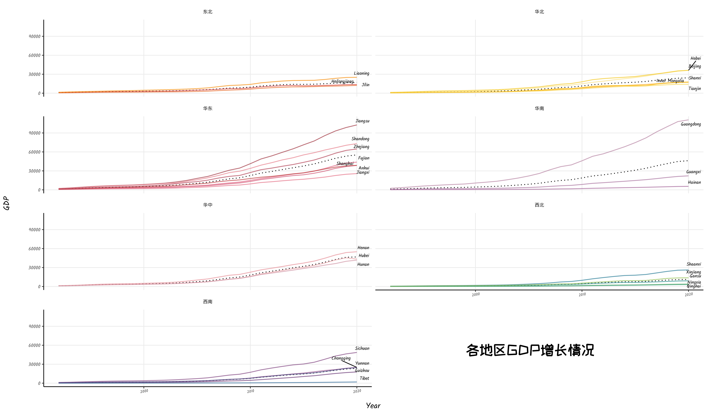
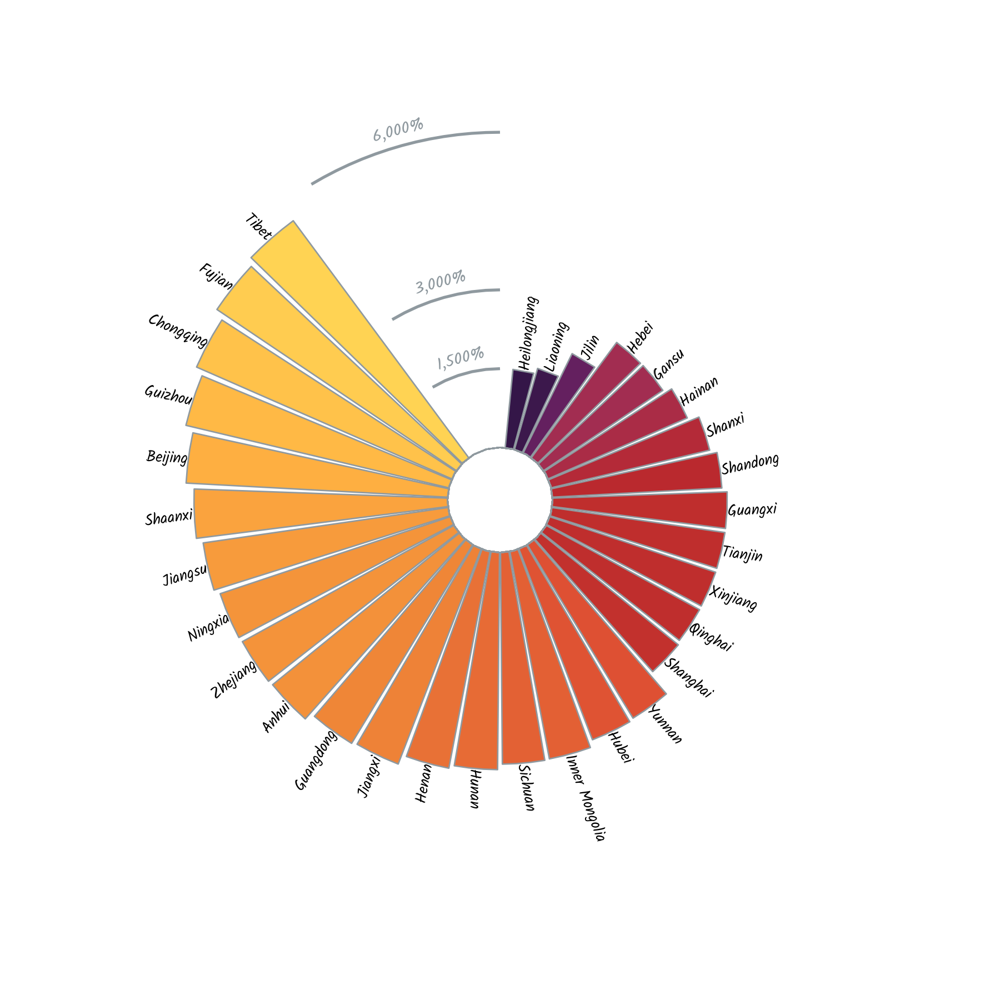
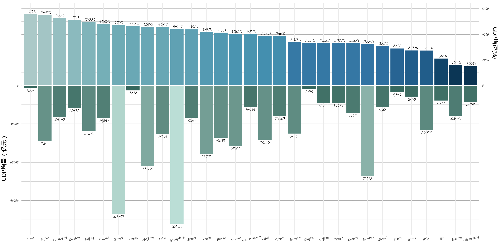
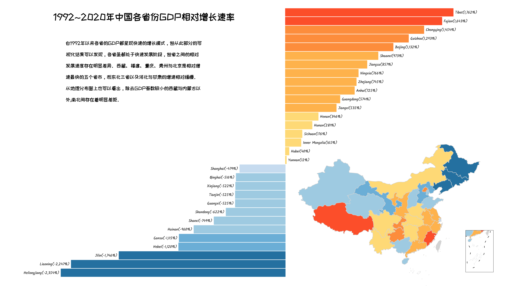

### **这是我第二次尝试记录我的数据分析结果，这次我们把目光移回到国内，重点关注：**

-   中国各省市和地区的GDP发展情况
-   对各省市的发展快慢进行排名
-   探索每个省市和地区的相对发展速度（与平均GDP增长率相比）
-   绘制GDP相对增长地图

所以本文除了涉及之前的柱状图以外，还会展示如何在R中绘制地图。

**本文的所有数据大部分来源于Kaggle还有中华人民共和国民政部的开放数据，感谢它们！:pray::pray:**

### **一、各区域GDP增长情况**
在本节，我们会将各个省份划分为不同的地区，看看不同地区的GDP发展情况如何。
#### **首先清洗数据**

```{r eval=FALSE, message=FALSE, include=FALSE}
#加载包
library(rio)
library(tidyverse)
library(MetBrewer)
library(showtext); showtext_auto()
library(ggmap)
library(mapproj)
library(sf)
library(ggrepel)
library(extrafont)
library(RColorBrewer)
library(cowplot)
library(ragg)
#导入字体
font_add_google("Calligraffitti", "call")
font_add_google("Kalam", "kalam")
font_add_google("ZCOOL KuaiLe", "cool")
```

```{r 加载数据, eval=FALSE, message=FALSE, include=FALSE}
#读入数据
china_map = st_read(dsn = "http://xzqh.mca.gov.cn/data/quanguo.json", stringsAsFactors = FALSE) 
st_crs(china_map) <- 4326 #设置地图坐标系统为 WGS84
data1 <- import('Chinas GDP in Province En.csv') #GDP数据
line <- st_read('geojson/九段线GS（2019）1719号.geojson') #用于绘制南海9段线
#数据预处理
GDP_long <- data1 %>% 
  rename(Guangxi = `Guangxi,`, #广西省名称有误，修改
         year = V1) %>% 
  pivot_longer(cols = 2:ncol(data1),names_to = 'Province', values_to = 'gdp') %>% 
  mutate(quhao = case_when(
    Province == 'Beijing' ~ '110000',
    Province == 'Tianjin' ~ '120000',
    Province == 'Hebei' ~ '130000',
    Province == 'Shanxi' ~ '140000',
    Province == 'Inner Mongolia'~ '150000',
    Province == 'Liaoning'~ '210000',
    Province == 'Jilin'~ '220000',
    Province == 'Heilongjiang'~ '230000',
    Province == 'Shanghai'~ '310000',
    Province == 'Jiangsu'~ '320000',
    Province == 'Zhejiang'~ '330000',
    Province == 'Anhui'~ '340000',
    Province == 'Fujian'~ '350000',
    Province == 'Jiangxi'~ '360000',
    Province == 'Shandong'~ '370000',
    Province == 'Henan'~ '410000',
    Province == 'Hubei'~ '420000',
    Province == 'Hunan'~ '430000',
    Province == 'Guangdong'~ '440000',
    Province == 'Guangxi'~ '450000',
    Province == 'Hainan'~ '460000',
    Province == 'Chongqing'~ '500000',
    Province == 'Sichuan'~ '510000',
    Province == 'Guizhou'~ '520000',
    Province == 'Yunnan'~ '530000',
    Province == 'Tibet'~ '540000',
    Province == 'Shaanxi'~ '610000',
    Province == 'Gansu'~ '620000',
    Province == 'Qinghai'~ '630000',
    Province == 'Ningxia'~ '640000',
    Province == 'Xinjiang'~ '650000'), #为省份赋予区号，便于后续后并数据
    area = case_when(substring(quhao,1,1) == '1' ~ '华北',
                     substring(quhao,1,1) == '2' ~ '东北',
                     substring(quhao,1,1) == '3' ~ '华东',
                     quhao %in% c('410000','420000','430000') ~ '华中',
                     quhao %in% c('440000','450000','460000') ~ '华南',
                     substring(quhao,1,1) == '5' ~ '西南',
                     substring(quhao,1,1) == '6' ~ '西北')) 
```

#### **进行可视化展示**
```{r 可视化展示1, eval=FALSE, message=FALSE, include=FALSE}
GDP_long %>%  
  ggplot(aes(x=year, y = gdp))+
  facet_wrap(~area,ncol = 2,strip.position = "top")+
  stat_summary(aes(x = year, y = gdp, group = area), fun.y = 'mean', geom = 'line',
               size = 0.6, lty = 'dotted',color = 'black')+
  geom_line(aes(group = Province,color = quhao),size = 0.6, alpha = 0.7,show.legend = F)+
  geom_text_repel(data = GDP_long[GDP_long$year == '2020',],aes(label = Province),
                  nudge_y = 1500,max.overlaps = 13, nudge_x = 1, size = 6, alpha = 1, family = 'kalam')+
  theme_classic()+
  scale_color_manual(values = met.brewer('Signac',length(unique(GDP_long$quhao))),guide='none')+
  labs(x = 'Year', y = 'GDP')+
  theme(panel.grid.major = element_line(),
        strip.background = element_blank(),
        strip.text = element_text(size = 18, family = 'wqy-microhei'),
        strip.placement = 'outside',
        axis.title = element_text(size = 30, family = 'kalam'),
        axis.text.y = element_text(size = 18,family = 'kalam'),
        axis.text.x = element_text(size = 14, angle = 10, family = 'kalam'),
  ) -> GDP_line
#ggsave('GDP/GDP_line.png',GDP_line, height = 18, width = 32, unit = 'cm', scaling = 1, bg = 'white')
```
<font size=2><center>各地区GDP发展时序图</center></font>


我们最终得到了可视化的结果，图中黑色虚线代表了各地区的平均发展速度。从上图大致可以看出 **_华东、华南、华中、西南_** 地区的GDP上升速度是比较快的，而 **_华北、西北、东北_** 则相对缓慢。具体来看：

  1.  华东地区发展较快，以江苏、山东、浙江为代表；
  2.  华中地区发展最为均衡，三省之间差异不大；
  3.  华南地区主要由广东带动其发展，其余两省似乎难以望其项背；
  4.  北方的省市均稍显颓势，东北三省的发展均有所落后

总体来说，图上所呈现的模式大致与我们平时所了解的东南部强势、西北部弱势相吻合。

### **二、各省市GDP增速排行**
本节将会对具体各省市的发展情况进行排名并予以展示。

#### **数据清洗**

```{r eval=FALSE, message=FALSE, include=FALSE}
#数据清洗
GDP_long %>%  
  pivot_wider(names_from = year,values_from = gdp, names_prefix = 'year',names_sort = T) %>% #将年份长转宽，使得一行观察值代表每个省市
  mutate(ratio = (year2020 - year1992)/(year1992)) %>% #计算增长率
  arrange(ratio) %>% 
  mutate(Province = fct_reorder(Province, ratio),
         angle = 90 - 360*((as.numeric(Province) - 0.5)/(max(as.numeric(Province))+4)), #+4 流出空白区域
         hjust = if_else(angle < -90,1,0),
         angle = if_else(angle < -90,angle + 180,angle),
         relative = ratio - mean(ratio)) -> GDP_wide 
```

#### **结果可视化 - 环形柱状图**
```{r eval=FALSE, message=FALSE, include=FALSE}
#结果可视化
GDP_wide %>% 
  ggplot(aes(x= as.numeric(Province), y = ratio)) + 
  geom_col(aes(fill = ratio),color = '#8F999F',show.legend = F, size = 0.3)+
  coord_polar() +
  geom_text(aes(y = ratio+0.2,label = Province, angle = angle, hjust = hjust), vjust = 0.5, size = 7, family = 'kalam') +
  scale_y_continuous(expand = c(0,0), limits = c(-10, max(GDP_wide$ratio)+10), labels = scales::percent_format()) +
  xlim(c(0,nrow(GDP_wide)+4))+
  geom_segment(data = data.frame(x = rep(nrow(GDP_wide)+1,3),
                                 xend = rep(nrow(GDP_wide)+4,3),
                                 y = c(15,30,60),
                                 yend = c(15,30,60)),
               aes(x = x, xend = xend , y =y, yend =yend), color = '#8F999F',size = 0.6) +
  geom_segment(aes(x = 0, xend = nrow(GDP_wide)+4, y = 0 , yend = 0),color = '#8F999F',size = 0.3)+ #内部圆环
  geom_text(data = data.frame(label = c('1,500%',"3,000%","6,000%"),
                              y = c(15,30,60)),
            aes(x = nrow(GDP_wide)+2.5, y = y + 2, label =label),vjust = 0, 
            angle = 360 - 360*(nrow(GDP_wide)+2.5)/(max(as.numeric(GDP_wide$Province))+4),
            size = 8, family = 'kalam',color = '#8F999F')+
  theme_void()+
  scale_fill_gradientn(colors=met.brewer("Tam", direction = -1)) -> GDP_cycle

#ggsave("GDP/GDP_cycle.png", GDP_cycle, width = 6, height = 6, scaling = 1, bg = 'white')
```



通过环形图可以看到与第一部分的结论一致，东北三省的增长速度确实是最为缓慢的，这可能与中国工业逐步转型有关。但让人惊讶的是上海的排名也位于下半区，这好像与我的理解有出入，这可能跟1992年GDP基数大小有关，西藏位于排头可能也有这方面的原因。为此，下文将进一步将***增量***与***增速***同时进行考虑，来更好地理解环形图的结果。

#### **结果可视化 - 双轴柱状图**

```{r eval=FALSE, message=FALSE, include=FALSE}
#绘制双轴柱状图
GDP_wide %>% 
  mutate(incs = year2020 - year1992) %>% 
  ggplot() +
  geom_col(aes(x = reorder(Province, -ratio), y = -incs, fill = incs),show.legend = F) +
  scale_fill_gradient(low = '#33655b', high = '#bbded6')+
  new_scale_fill()+
  geom_col(aes(x = reorder(Province, -ratio), y = ratio*1000,fill = ratio),show.legend = F)+
  scale_fill_gradientn(colors = met.brewer('Hokusai2', direction = -1))+
  scale_y_continuous(breaks = c(seq(-90000, 0, 30000), c(20000, 40000, 60000)), 
                     labels = c("90000","60000","30000","0","","",""),
                     sec.axis = sec_axis(~ ./10, name = "GDP增速(%)", 
                                         breaks = seq(0, 6000,2000))) + 
  geom_text(aes(x = reorder(Province, -ratio), y = ratio*1000, 
                label = paste0(scales::comma(round(ratio*100),1.0),"%")),
            hjust = 0.4, vjust = -0.5, size =6.5, family = 'call') +
  geom_text(aes(x = reorder(Province, -ratio), y = -incs, 
                label = scales::comma(incs,1.0)),
            hjust = 0.5, vjust = 1.5, size =6.5, family = 'call') +
  geom_hline(aes(yintercept = 0), size = 0.6 , color = "white") +
  theme_minimal()+
  labs(y =" GDP增量（亿元）")+
  theme(panel.grid.minor.x = element_blank(),
        panel.grid.major.y = element_line(size = 0.4, color = 'darkgray'),
        panel.grid.minor.y = element_line(size = 0.3, color = 'lightgray'),
        axis.text.y = element_text(size = 18, family = 'kalam'),
        axis.title.y.left = element_text(hjust = 0.28, size = 32, vjust = 2),
        axis.title.y.right = element_text(hjust = 0.12, size = 32, vjust = 2),
        axis.title.x = element_blank(),
        axis.text.x = element_text(size = 18, family = 'kalam', angle = 15, hjust = 0.5)) -> compare_col
ggsave("GDP/GDP_two_axes.png", compare_col, width = 12, height = 6,bg = 'white')
```
<font size=2><center>各省市GDP增速与增量</center></font>


将这部分的结果结合环形图来看的话，可以发现一些地区虽然增速较快的实际的增量却不是很大，尤其是西部的地区比如西藏、宁夏、青海等。江苏和广东则是增量大的同时增速也很快。而浙江属于增速快而增量较大、上海增量较大而增速相对较缓。而东北三省在考虑到增量以后仍不容乐观。因此如何进一步促进西部与北部地区的发展仍然是我们需要去解决的问题。

### **三、中国GDP地图**
本节将继续考虑各省市的GDP相对增长速度,本文对其的定义是：<u>*相对于平均增长速度的差异*</u>。并将结果用地图的形式绘制出来。

#### **数据清洗**

```{r eval=FALSE, message=FALSE, include=FALSE}
#数据清洗
GDP_map <- china_map %>% 
  rename(quhao = QUHUADAIMA) %>% 
  mutate(quhao = case_when(quhao== 'daodian' ~ NAME,
                           TRUE ~ quhao)) %>% 
  select(quhao,geometry) %>% 
  left_join(GDP_wide, by = 'quhao') %>% 
  select(Province,ratio, geometry, relative) %>% 
  mutate(hjust = if_else(relative >= 0, 0,1),
         type = case_when(relative >= 15 ~ 1,
                          10 <= relative & relative < 15  ~ 2,
                          5 <= relative & relative <  10  ~ 3,
                          0 <= relative & relative <  5  ~ 4,
                          -5 <= relative & relative < 0  ~ 5,
                          -10 <= relative & relative < -5  ~ 6,
                          -15 <= relative & relative < -10  ~ 7,
                          relative < -15 ~ 8),
         type = factor(as.character(type)),
         fill = case_when(type == "1" ~ "#FC4E2A",
                          type == "2" ~ "#FD8D3C",
                          type == "3" ~ "#FEB24C",
                          type == "4" ~ "#FED976",
                          type == "5" ~ "#C6DBEF",
                          type == "6" ~ "#9ECAE1",
                          type == "7" ~ "#6BAED6",
                          type == "8" ~ "#2470a0",
                          TRUE ~ "lightgrey"))%>% 
  arrange(desc(relative)) 
```

#### **结果可视化**
##### **主要地图**
```
#绘制主要地图
GDP_map %>% 
  ggplot()+
  geom_sf(aes(fill = fill, geometry = geometry),show.legend = F,color = 'lightgrey', size = 0.5) +
  scale_fill_identity()+
  theme_void()+
  theme(aspect.ratio = 0.93) -> MGDP
```
##### **南海九段线**
```
#绘制南海九段线
GDP_map %>% 
  ggplot()+
  geom_sf(aes(fill = fill, geometry = geometry),show.legend = F,color = 'lightgrey', size = 0.5) +
  scale_fill_identity()+
  geom_sf(data = line) +
  coord_sf(xlim = c(108,124), ylim = c(2,24))+
  theme(aspect.ratio = 1.5, #调节长宽比
        axis.text = element_blank(),
        axis.ticks = element_blank(),
        axis.title = element_blank(),
        panel.grid = element_blank(), #panel - 分面或者单图的画布信息
        panel.background = element_blank(),
        panel.border = element_rect(fill=NA, color="grey10",linetype=1,size=0.5),
        plot.margin=unit(c(0,0,0,0),"mm")) -> nine_line
        
```
##### **相对发展柱状图**
```
GDP_map %>%
  mutate(Province = fct_reorder(Province, relative),
         label = paste0(Province,"(",scales::comma(round(relative*100),1),"%",")")) %>% 
  distinct(Province, .keep_all = T) %>% 
  filter(!is.na(Province)) %>% 
  ggplot()+
  geom_col(aes(x=Province,y = relative, fill = fill, color = fill)) +
  scale_fill_identity()+
  scale_color_identity()+
  coord_flip()+
  geom_text(aes(x = Province, y = relative+0.2 - hjust * 0.4 ,label = label, hjust = hjust), vjust = 0.5, size = 7, family = 'kalam') +
  scale_y_continuous(labels = scales::percent_format(), limits = c(-27,20)) +
  theme_classic()+
  theme(axis.ticks= element_blank(),
        axis.line = element_blank(),
        axis.text = element_blank(),
        axis.title = element_blank(),
        plot.title = element_text(hjust = 0.5,size = 18),
        plot.margin= margin(0,8,0,8,unit = 'mm')) -> relative_plot        
```
##### **合并图片**

```
text = '自1992年以来各省的GDP都呈现快速的增长模式，但从此部分的可\n视化结果可以发现，各省虽都处于快速发展阶段，但省之间的相对\n发展速度存在明显差异。西藏、福建、重庆、贵州与北京是相对增\n速最快的五个省市，而东北三省以及河北与甘肃的增速相对缓慢。\n从地理分布图上也可以看出，除去GDP基数较小的西藏与内蒙古以\n外,南北间存在着明显差距。'
ggdraw(xlim = c(0.15,1),ylim = c(0,1))+
  draw_plot(relative_plot,x = 0.57, y = 0.5,hjust = 0.5, vjust = 0.5, width = 0.85,height = 0.95)+
  draw_plot(MGDP, x = 0.8, y = 0.20,hjust = 0.5, vjust = 0.5,width = 0.65,height = 0.65)+
  draw_plot(nine_line, x = 0.95, y = 0.12,hjust = 0.5, vjust = 0.5, width = 0.15,height = 0.15)+
  draw_text('1992~2020年中国各省份GDP相对增长速率',x = 0.39, y = 0.94,hjust = 0.5, vjust = 0.5, size = 54, family = 'cool')+
  draw_text(text,x = 0.26, y = 0.75,hjust = 0, vjust = 0.5, size = 28, lineheight = 1, family = 'cool') -> final_plot
final_plot
ggsave('GDP/GDP_MAP.png',final_plot, height = 18, width = 32, unit = 'cm', scaling = 0.6, bg = 'white')
```
<font size=2><center>1992-2020GDP相对增长</center></font>


正如图上所描述的：自1992年以来,近30年间各省的GDP都呈现向上增长的发展模式，但省之间的发展速度存在明显差异。西藏、福建、重庆、贵州与北京相对增速最快，而东北三省以及河北与甘肃的增速相对缓慢。从地图的分布上看，再次通过另一种形式表现出了南、北与东、西之间的发展差异。

本次的内容结束了，内容并不是很多。如果有什么建议或者问题欢迎联系我:iphone::love_letter: 或者给我留言~
